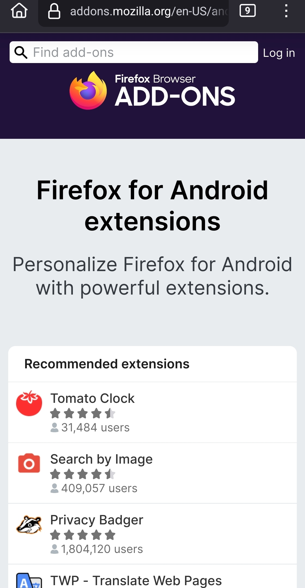
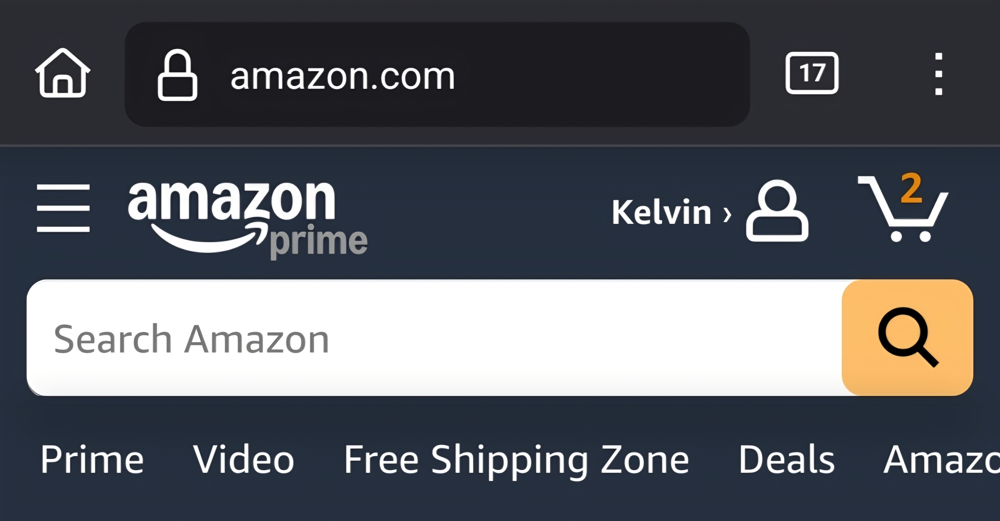
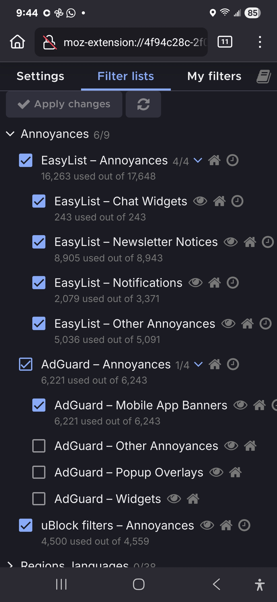

Currently, Firefox has features that no major browser has, like:
## Browser Extensions on mobile 

Firefox is the only mainstream browser that supports extensions on mobile (Android ) and the reason I won't get an !Phone.

There are many extensions, that have improved my browsing experience dramatically, by helping me fight the **bloat** of modern web browsing. This is especially more important on mobile, where resources and screen space are more limited. 

The extension store is very similar to the desktop one. My browsing use case on my phone is to read articles, look up something quickly, buy things in online stores, or just see what people are saying online. When I do that, I don't want to see ads, and I don't want pop-ups taking up half of my screen.
No, I don't want to download your **app**, 
_the website is fine_, Nor I want to talk with your AI chat. I'm not interested in receiving fake notifications either. And I might have subscribed to your newsletter if you didn't put a pop-up while I was midway through reading your article. 

The following extensions have helped me in my fight against bloat and antipatterns on the web. Making my time on the web rather  a  pleasant experience
If you just want the full list go here it is !

 I hate ads and banners

[Ublock](https://addons.mozilla.org/en-US/firefox/addon/ublock-origin/)  is the best ad blocker. Besides blocking ads, it also blocks other annoyances such as mobile banners, like those super annoying ones where they tell you to download their app instead of letting you use their website

 **Amazon your app sucks and I won't use it** 
 
Then, with the ublock enabled 

### Ublock filter lists
Here it's my the filter list that I use that not only removes those install the app for the  _best experience_. They also remove other annoyances like  chat widgets, newsletter notices, popups, cookie banners, etc.

To activate it go to  the 
extensions menus.
Press the  Ublock one and then press in 
**Open the dashboard** 
And the go to the filter lists tab.

There is the step by step tutorial with images 

 
## I hate the Medium UI 

So when you open a medium article you get the following delightful UX

A full screen pop-up to suscribe

And after you close it, they show you  bunch of annoying elements in the article 

Compare that with the beautiful experience you get with the Scribe front-end.

The extension that makes this possible is called **LibRedirect**

### X, I want to see the comments!

Twitter/x. won't let you to see the comments unless you create an account

If you tap in read replies button you'll be presented with a log in screen

Compare with the nitter frontent also using LibRedirect  where you can actually see **comments**

## Don't fuck with paste 

This one is self-explanatory, but if you hate that some sites don't let you paste as me, this is for you.

[Don't fuck with paste](https://addons.mozilla.org/en-US/firefox/addon/don-t-fuck-with-paste/?utm_source=addons.mozilla.org&utm_medium=referral&utm_content=search)
## Can I just listen to something in the background?

This extensions will allow you to fix issues in some sites where they don't let you to play audio in the background 

[Video background play fix](https://addons.mozilla.org/en-US/firefox/addon/video-background-play-fix/)

## 404 Not found 

When this happens, you want to look up for a tool that let's you to check for an archived version.
Web archives let's you to do exactly that

It even let's you to choose from multiple archive sites 
[Web archives](https://addons.mozilla.org/en-US/firefox/addon/view-page-archive/)

## Stop wasting time on the web 

Are you wasting time on the web?  
Install [Lechblock](https://addons.mozilla.org/en-US/firefox/addon/leechblock-ng/)
You can block websites, set time limits and more with Lechblock 

##   Sync

 The other nice thing, about Firefox is that if you use Firefox on desktop, you can sync your data between your phone and your desktop easily.
 

You can see the tabs opened on your desktop 

A useful feature is send to the  desktop Where yoYouan send tabs for checking them later  on your computer.

## customize homepage 

you can customize the home page to only leave what you want. I for example remove sponsored shortcuts and stories.
